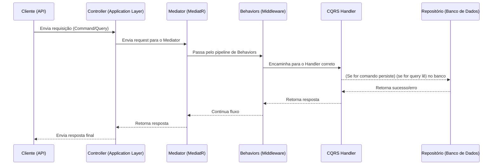
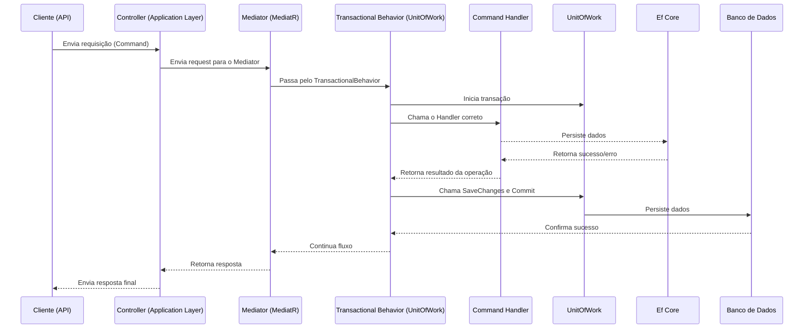
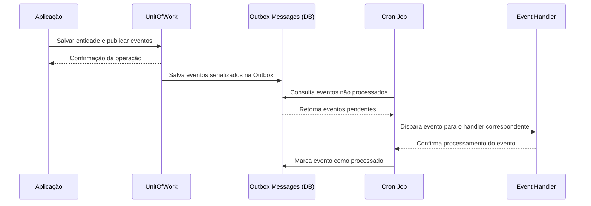
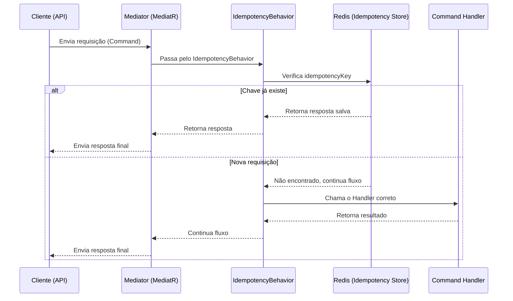

## Desafio proposto:
____

- Um comerciante precisa controlar o seu fluxo de caixa diário com os lançamentos
(débitos e créditos), também precisa de um relatório que disponibilize o saldo
diário consolidado.

- Chamarei de EasyCash

## Requisitos de negócio

- Serviço que faça o controle de lançamentos
- Serviço do consolidado diário

## Requisitos técnicos obrigatórios
- Deve ser feito usando C#
- Desenho da solução
- Testes
- Boas praticas são bem vindas (Design Patterns, Padrões de Arquitetura,
SOLID e etc)

## Requisitos não funcionais

- O serviço de controle de lançamento não deve ficar indisponível se o sistema de
consolidado diário cair. 
- Em dias de picos, o serviço de consolidado diário recebe
50 requisições por segundo, com no máximo 5% de perda de requisições.

# Definindo a tecnologia e arquitetura Para estar de acordo com os requisitos técnicos

- A aplicação será em .net core, desenvolvida pra ser stateless e cloud native.
- Serão dois microsserviços um para controle de fluxo de caixa e outro para relatório.
    - Considerei brevemente deixar ambas na mesma aplicação e separar apenas o banco da dados para atender aos requisitos, mas descartei imediatamente visto que o serviço de relatórios não precisa escalar na mesma proporção da aplicação de fluxo de caixa, apesar de isso não ser um problema grande eu posso gerenciar melhor recursos valiosos de maquina.
    - Consistência eventual não será um problema pra esse tipo de aplicação, visto que a consolidação é diária.
- Para arquitetura eu decidi usar clean architecture, mesmo sempre uma aplicação simples, assim tenho cada camada e responsabilidade bem definida e fica mais fácil saber onde está cada coisa pela sua esponsabilidade.
- Para autenticação quero utilizar um servidor de identidade como fonte da verdade para a parte de autenticação
- Para o dominio irei usar DDD (Domain Driven Design), também para fins de organização, legibilidade e melhor manutenção, baixo acoplamento, encapsulamento, testes entre outros benefícios.
- Junto com o DDD irei utilizar (EDA) (Event driven arquitecture) para disparar eventos, possibilitando integração entre dominios de forma desacoplada e fluxos de dados menos complexos.
- Para os eventos emitidos irei utilizar o pattern transaction outbox, persistindo as mensagens no banco de dados e processando-as fora da requisição original.
- Mesmo sendo uma aplicação simples, pensei em utilizar CQRS para separar o comandos de consultas e assim poder utilizar ef core para comandos e dapper para consultas, acho mais simples de fazer dessa orma, apesar de não parecer inicialmente, a medida que as aplicações crescem se torna claro o motivo disso ser uma boa escolha evitando complexidade desnecessária e possibilitando usar bancos de dados e leitura no futuro caso seja necessário.
- Para comunicação entre infraestrutura e aplicação irei utilzar o pattern mediator centralizando a comunicação e promovendo baixo acoplamento entre as camadas.
- A arquitetura definida também é bem fácil de se realizar manutenção quando se entende os conceitos.

# Definindo o tipo de banco de dados:
- Como é um serviço que trabalha com valores monetários eu que preciso é de um banco relacional pelo forte acoplamento, ACID e transações.
    - Postgress é a melhor escolha por ser gratuito altamente escalável e muito confiavel, é possivel escalar horizontalmente fazendo sharding e é extesível para trabalhar com nosql e full-text-search e timescaledb (bom pra metricas, logs e relatórios).
- Será uma database para cada aplicação, garantindo assim que alguma indisponibilidade em uma não afete a outra.

# Definindo cache e mensageria
- Escolhi o Redis: Defendendo a escolha do redis como ferramenta, ele é amplamente utilizado tendo uma comunidade enorme, é escalável e possui integrado a ele varios recursos que precisamos nesse tipo de aplicação.
- Redis streams para mensageria para garantir resiliência nas aplicações garantindo que caso tenha alguma indisponibilidade nenhuma mensagem seja perdida e possa ser consumida quando a aplicação voltar a ficar online.
- Não vejo sentido em cogitar qualquer outra ferramenta para cache distribuido. (definiremos estratégias de cache posteriormente em cada funcionalidade.)

# Observabilidade

- Vai ser usado o padrão CNCF OpenTelemetry para escoamento de metricas, logs e traces, o open telemetry é open source, um dos maiores projetos da CNCF junto, não é vendor lock-in, pode escoar logs pra qualquer vendor do mercado e é amplamente utilizado .
- Utiliza o aspire dashboard para visualiação. Para abrir o aspire dashboard http://localhost:18888/ e obter o token do log do aspire ``` docker logs easycash-aspire-dashboard ``` procurar por algo como http://0.0.0.0:18888/login?t=0eb9b5e395470399e4d0b06d9bb6e65a onde o ``` 0eb9b5e395470399e4d0b06d9bb6e65a ``` é o token a ser utilizado.

# Design do Software

- ** Estrutura de pastas **
____

# EasyCash Solution

📂 Application
 ├─ EasyCash.Command
 └─ EasyCash.Query
📂 Infraestructure
 ├─ 📂 Database
 │  ├─ EasyCash.Command.Store
 │  └─ EasyCash.Query.Store
 ├─ 📂 Api
 │  ├─ EasyCash.Api
 │  └─ EasyCash.Report.Api
 └─ 📂 Integrations
    ├─ EasyCash.Background.Jobs
    ├─ EasyCash.Dapper.Provider
    ├─ EasyCash.HealthCheck.Provider
    ├─ EasyCash.OpenTelemetry
    ├─ EasyCash.Redis.Provider
    ├─ EasyCash.Authentication.Provider
    └─ EasyCash.Authorization.Provider
📂 Domain
 └─ EasyCash.Domain
📂 Tests
 ├─ EasyCash.ArchitectureTests
 ├─ EasyCash.Unit.Tests
 └─ EasyCash.Integration.Tests

- Para autenticação e autorização considerei utilizar o proprio identity já disponível no .net core, mas por familiaridade vou utilizar o keycloak
- Entity Framework Core para persistência de dados
    - ef core migrations para aplicar mudanças no banco de dados
- Dapper para queries de consulta
- O pacote MediatR está sendo utiliado por ser fácil e ter as funcionalidaes que preciso para enviar requisições, eventos e ter os behaviors que usarei para algumas funcionalidades.
- Transaction outbox roda em um job no quarkus em uma cron job
- A aplicação de EasyCash.Api utiliza o database EasyCash e EasyCash.Report.Api irá utilizar EasyCash_Report
- utiliza injeção de dependencia nativa do .net core
- Health checks no endpoint /health para que o service discovery possa identificar corretamente a aplicação saudavel, verificando acesso a banco de dados, redis e identity provider
- Open


## Diagrama de auto nível

-- Assets/diagrama-macro.drawio


## Diagrama sequencia requests (sem autenticação/autorização)



## Diagrama sequencia UnitOfWork


## Diagrama outbox



## Diagrama de chamadas com idempotencia



## Considerações adicionais
- Backup dos bancos de dados, definir frequencia e estratégias.
- Penso em estratégias de retry para consumo de mensagens que eventualmente ocorrerem problemas aplicando conceito de dead letter queues e retry com backoff exponencial, não irei fazer isso nesse teste devido a complexidade.
- Criar pipeline CI
- Criar IaaS (infraestrutura como serviço) para implantação e mudanças de forma rápidas e consistentes.
- Adicionar variaveis de ambientes e vault para senhas e secrets