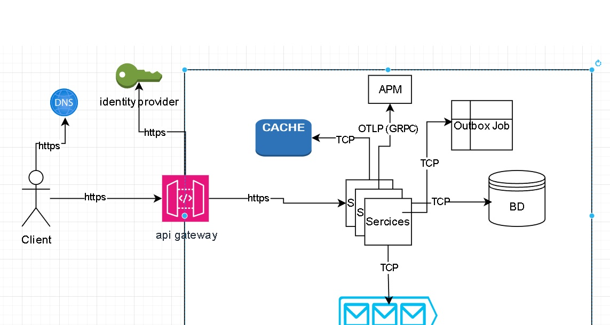
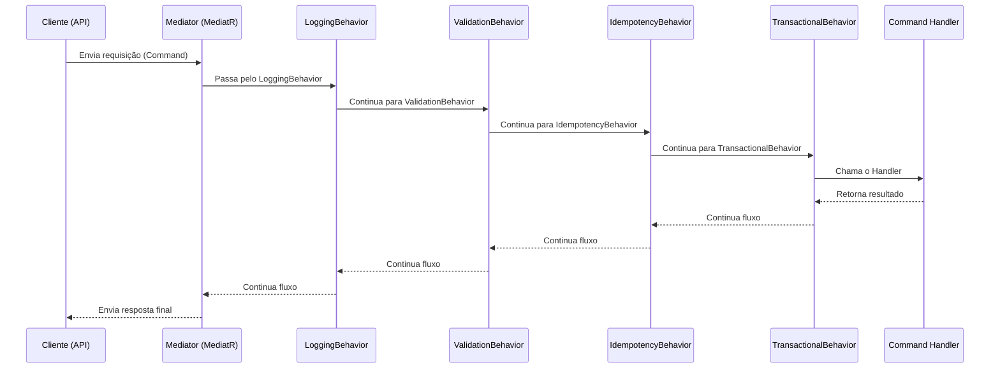
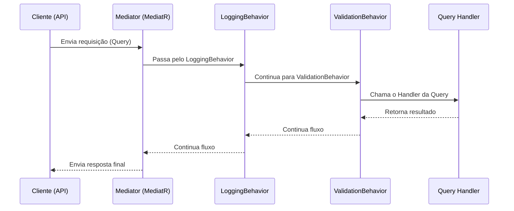
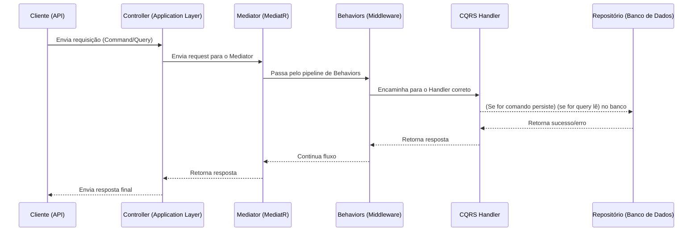
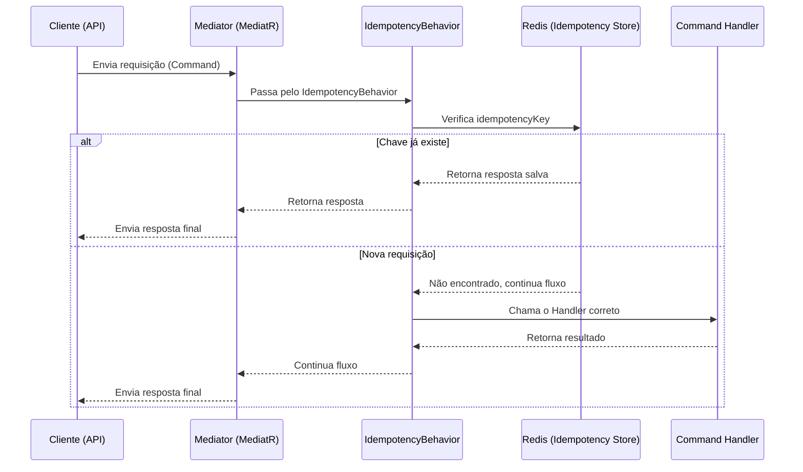
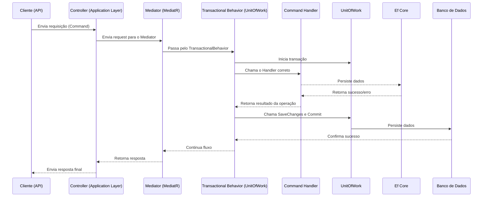
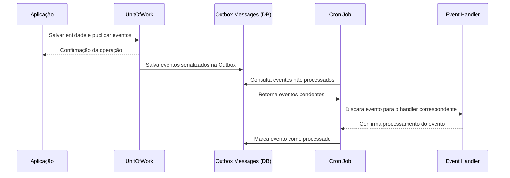
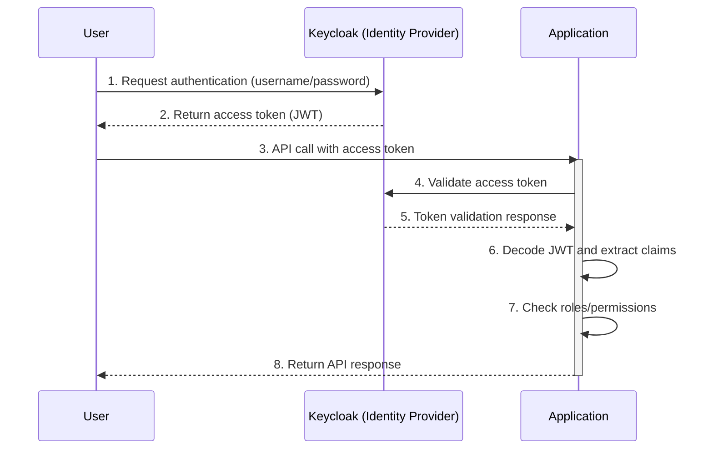
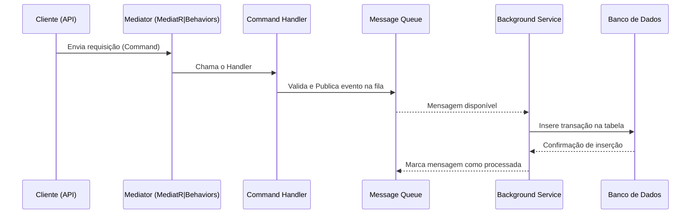

# Como rodar localmente
- tenha certeza de que possui o docker com docker-compose instalado, caso não possua pode seguir um tutorial: [instação docker](https://github.com/codeedu/wsl2-docker-quickstart)
- na pasta raiz do projeto tem um docker-compose, então abra no terminal ou powershell e rode o commando ``` docker-compose up -d ``` 
- Aguarde um pouco até os serviços iniciarem, pode demorar um pouco na primeira vez.
- Rode o projeto pelo visual studio usando o kestrel **(não pelo docker por causa do keycloak, teria que alterar as configurações do client)**.
  - Configure as api's para rodar simultanêamente. Clique com o botão direito no projeto selecione "Configure Startup Projects..." na janela que vai se abrir clique no checkbox "Multiple Startup Projects" e no action muda para "Start" nas aplicações EasyCash.Api e EasyCash.Report.Api, aplique as mudanças.
- Os projetos irão estar rodando em ``` https://localhost:7152/swagger ``` e ``` https://localhost:7141/swagger ``` (para https) conforme configurado no launchSettings

Os serviços necessarios e database são criados pelo docker-compose, e já estão com a importação de informações necessarias para funcionamento, caso precise de ajuda pode abrir uma issue.

- Deixei um ``` EasyCash.Api.http ``` na raiz da api para criar usuario e criar uma transação, pode logar com o user: test@easycash.com.br e senha: 123456 ou pode criar um user direto no swagger (em select a definition trocar para users).
- Deixei um ``` EasyCash.Report.Api.http ``` na raiz do projeto de report também com requests basicos.

## Desafio proposto:

- Um comerciante precisa controlar o seu fluxo de caixa diário com os lançamentos
(débitos e créditos), também precisa de um relatório que disponibilize o saldo
diário consolidado.

- Chamarei de EasyCash

## Requisitos de negócio

- Serviço que faça o controle de lançamentos
- Serviço do consolidado diário

## Requisitos técnicos obrigatórios
- Deve ser feito usando C#
- Desenho da solução
- Testes
- Boas praticas são bem vindas (Design Patterns, Padrões de Arquitetura,
SOLID e etc)

## Requisitos não funcionais

- O serviço de controle de lançamento não deve ficar indisponível se o sistema de
consolidado diário cair. 
- Em dias de picos, o serviço de consolidado diário recebe
50 requisições por segundo, com no máximo 5% de perda de requisições.


# O que esperar da aplicação após executar?

**Serviço de transações**
Você vai precisar criar um usuario e começar a fazer requests de transações na api ``` EasyCash.Api ``` essas requisições irão apenas validar os dados de entrada, postar um evento de integração e devolver o request com status code 200 em caso de sucesso ou erros de validação em caso de erros.
Após postar o evento de integração existe um background consumer que irá ler da fila e gravar no banco de dados na tabela de transações da aplicação ``` EasyCash.Api ```

**Serviço de consolidação (chamei de Report)**
O evento de integração (gerado pela api de transações) é consumido pela aplicação ``` EasyCash.Report.Api ``` que vai gravar em sua tabela as informações de que precisa da transação para gerar a consolidação diária.
Ao final de cada dia irá rodar um job que irá chamar o serviço de consolidação diária pro dia anterior (coloquei pra rodar sempre às 00:05).
  O serviço de consolidação irá calcular os creditos e débitos e o saldo final e gravar na tabela de consolidação.
  Deixei um endpoint pra chamar o serviço de consolidação sem precisar esperar pelo job (apenas pra testes)
Deixei um endpoint de get para gerar um "relatório" por datas.


# Definindo a tecnologia e arquitetura Para estar de acordo com os requisitos técnicos

- A aplicação será em .net core, desenvolvida pra ser stateless e cloud native ou seja rodar em container, podendo usar qualquer serviço de orquestração de containers como kubernetes ou container service.
- Serão dois microsserviços um para controle de fluxo de caixa e outro para relatório.
    - Considerei brevemente deixar ambas na mesma aplicação e separar apenas o banco da dados para atender aos requisitos, mas descartei imediatamente visto que o serviço de relatórios não precisa escalar na mesma proporção da aplicação de fluxo de caixa, apesar de isso não ser um problema grande eu posso gerenciar melhor recursos valiosos de maquina.
    - Consistência eventual não será um problema pra esse tipo de aplicação, visto que a consolidação é diária.
- Para arquitetura eu decidi usar clean architecture (mesmo sendo uma aplicação simples), assim tenho cada camada e responsabilidade bem definida e fica mais fácil saber onde está cada coisa pela sua responsabilidade.
- Para autenticação e autorização quero utilizar um servidor de identidade como fonte da verdade para a parte de autenticação
- Para o dominio irei usar DDD (Domain Driven Design), também para fins de organização, legibilidade e melhor manutenção, baixo acoplamento, encapsulamento, testes entre outros benefícios.
- Junto com o DDD irei utilizar (EDA) (Event driven arquitecture) para disparar eventos, possibilitando integração entre dominios de forma desacoplada e fluxos de dados menos complexos.
- Para os eventos emitidos irei utilizar o pattern transaction outbox, persistindo as mensagens no banco de dados e processando-as fora da requisição original.
- Mesmo sendo uma aplicação simples, pensei em utilizar CQRS para separar o comandos de consultas e assim poder utilizar ef core para comandos e dapper para consultas, acho mais simples de fazer dessa forma, apesar de inicialmente não parecer, a medida que as aplicações crescem se torna claro o motivo disso ser uma boa escolha evitando complexidade desnecessária e possibilitando usar bancos de dados de leitura no futuro caso seja necessário.
- Para comunicação entre infraestrutura e aplicação irei utilizar o pattern mediator centralizando a comunicação e promovendo baixo acoplamento entre as camadas.
- A arquitetura definida também é bem fácil de se realizar manutenção quando se entende os conceitos.


# Escalabilidade

- Com essa arquitetura a aplicação pode escalar horizontalmente usando AGS (auto scaling group) ou HPA (horizontal pod autoscaling) para atender à demanda.
- Projetei para que cada transacação enviada ao sistema vá inicialmente para uma fila para posterior processamento em background, garantindo assim uma maior quantidade de requisições, sem necessidade de aguardar o processamento emediato de operações mais longas como acesso a banco de dados e caso a aplicação tenha um alto volume de requisições.

## Falando um pouco de resiliencia
- a aplicação usa mensageria com redis stream, então caso caia por algum motivo, pode retormar a partir de onde parou. O redis stream armazena o ultimo offset lido no consumer group;
- possui health check com verificação de bd, redis e identity provider que verifica como está a saude da aplicação, com isso o orquestrador consegue verificar se a aplicação está saudável e caso não steja faça a reinicialização do container/pod;
- possui escoamento de metricas, log e traces pelo open telemetry, da pra plugar qualquer tipo de vendor para análise, optei por usar o aspire pela facilidade

## Segurança

- possui autenticação e autorização com identity provider que serve como fonte da verdade para dizer quem é o user que está autenticando o em que está autorizado acessar, e podendo gerenciar pelo keycloak.
- para ataques conhecidos e listados no OWASP optei por deixar a parte de segurança a cargo de um api gateway na borda da infraestrutura, api's gateways já são projetados e atualizos para mitigar problemas conhecidos e diante de tantas funcionalidades que um api gateway entrega não faz sentido reinventar a roda.

# Definindo o tipo de banco de dados:

- Como é um serviço que trabalha com valores monetários eu preciso de um banco relacional pelo forte acoplamento entre as tabelas, ACID e transações.
    - Postgress é a melhor escolha por ser gratuito altamente escalável e muito confiavel, é possivel escalar horizontalmente fazendo sharding e é extesível para trabalhar com nosql e full-text-search e timescaledb (bom pra metricas, logs e relatórios).
- Será uma database para cada aplicação, garantindo assim que alguma indisponibilidade em um serviõ não afete o outro.

# Definindo cache e mensageria
- Escolhi o Redis para esse trabalho. Foi escolhido o redis como ferramenta, pois ele é amplamente utilizado, é simples de iniciar e tem uma comunidade enorme, é escalável e possui integrado a ele varios recursos que precisamos nesse tipo de aplicação.
- Redis streams para mensageria para garantir resiliência nas aplicações garantindo que caso tenha alguma indisponibilidade nenhuma mensagem seja perdida e possa ser consumida quando a aplicação voltar a ficar online.
- Não vejo sentido em cogitar qualquer outra ferramenta para cache distribuido.

# Observabilidade

- Vai ser usado o padrão CNCF OpenTelemetry para escoamento de metricas, logs e traces, o open telemetry é open source, um dos maiores projetos da CNCF, não é vendor lock-in, pode escoar logs pra qualquer vendor do mercado e é amplamente utilizado.
- Utiliza o aspire dashboard para visualiação. Para abrir o aspire dashboard http://localhost:18888/ e obter o token do log do aspire ``` docker logs easycash-aspire-dashboard ``` procurar por algo como http://0.0.0.0:18888/login?t=0eb9b5e395470399e4d0b06d9bb6e65a onde o ``` 0eb9b5e395470399e4d0b06d9bb6e65a ``` é o token a ser utilizado.

# Design do Software

- ** Estrutura de pastas **

# EasyCash Solution

```
Abstractions/
├── EasyCash.Abstractions/
Application/
└──  Report
│   ├──  EasyCash.Report.Command/
│   ├──  EasyCash.Report.Query/
└── Transactions
│   ├── EasyCash.Command/
│   ├── EasyCash.Query/
Infraestructure/
└──  Database/
│   └──  Report
│   ├────── EasyCash.Report.Command.Store/
│   └────── EasyCash.Report.Query.Store/
│   └── Transactions
│   └────── EasyCash.Command.Store/
│   └────── EasyCash.Query.Store/
└──  Api/
│   ├── EasyCash.Api/
│   |── EasyCash.Report.Api/
└──  Integrations/
    ├── EasyCash.Background.Jobs/
    ├── EasyCash.Dapper.Provider/
    ├── EasyCash.HealthCheck.Provider/
    ├── EasyCash.OpenTelemetry/
    ├── EasyCash.Redis.Provider/
    ├── EasyCash.Keycloak.Identity.Provider/
Domain/
└── ├── Report
│   ├────── EasyCash.Report.Domain/
│   ├── Transactions
│   ├────── EasyCash.Domain/
Tests/
├── EasyCash.ArchitectureTests/
├── EasyCash.Unit.Tests/
└── EasyCash.Integration.Tests/
```

- Para autenticação e autorização considerei utilizar o proprio identity já disponível no .net core, mas por familiaridade vou utilizar o keycloak
- Entity Framework Core para persistência de dados
    - ef core migrations para aplicar mudanças no banco de dados
- Utilização de pattern UnitOfWork para centralzar modificações em banco de dados em um só local.
- Dapper para queries de consulta
- O pacote MediatR está sendo utiliado por ser fácil e ter as funcionalidaes que preciso para enviar requisições, eventos e ter os behaviors que usarei para algumas funcionalidades.
- Transaction outbox roda em um job no quarkus em uma cron job
- A aplicação de EasyCash.Api utiliza o database ``` easycash ``` e EasyCash.Report.Api irá utilizar ``` easycash_report ```
- utiliza injeção de dependencia nativa do .net core
- Health checks no endpoint /health para que o service discovery possa identificar corretamente a aplicação saudável, verificando acesso a banco de dados, redis e identity provider


## Diagrama de auto nível

-- Assets/diagrama-macro.drawio



## Command flow pelos pipelines de requisição



## Query flow pelos pipelines de requisição




## Diagrama sequencia requests (sem autenticação/autorização)



## Diagrama de chamadas com idempotencia



## Diagrama sequencia UnitOfWork



## Diagrama outbox



## Autenticação e autorização flow




# Transaction flow

**Request** ``` POST /api/v1/CashFlows ```

```json
{
  "idempotencyKey": "86a9cf3e-e887-4831-8d61-93b1e5275926",
  "description": "description",
  "type": 1,
  "amount": 0,
  "category": "categoria",
  "date": "2025-03-04T17:36:58.839Z"
}
```

| Parâmetro | Tipo | Descrição |
|-----------------|------------|--------------------------------------------------------------------------------------|
| IdempotencyKey  | string     | Chave de idempotencia gerado pelo client para identificar a transação como única.    |
| Description     | string     | Descrição informada da transação.                                                    |
| Type            | enum       | Enumerado em inteiro que identifica se a transação é ``` 1 = Credit, 2 - Debit ```.  |
| Amount          | decimal    | Valor informado da transação.                                                        |
| Category        | string     | Categoria da transação.                                                              |
| Date            | DateTime   | Data da transação.                                                                   |

**Response** 
- Sucesso: responde com status code 200
- Erro de servidor: Reponse com 
```json
{
  "type": "ServerError",
  "title": "Server error",
  "status": 500,
  "detail": "An unexpected error has occurred",
  "requestId": "0HNAR8CKBG46L:00000007",
  "traceId": "ffeaf8ee657e0e25fa02b7611c499586"
}
```
- Erro de validação:
```json
{
  "type": "ValidationFailure",
  "title": "Validation error",
  "status": 400,
  "detail": "One or more validation errors occurred",
  "errors": [
    {
      "propertyName": "Description",
      "errorMessage": "'Description' must not be empty."
    },
    {
      "propertyName": "Amount",
      "errorMessage": "'Amount' must be greater than '0'."
    },
    {
      "propertyName": "Category",
      "errorMessage": "'Category' must not be empty."
    },
    {
      "propertyName": "Date",
      "errorMessage": "'Date' must not be empty."
    }
  ],
  "requestId": "0HNAR8CKBG46L:0000000F",
  "traceId": "aeb398268ee6c3316d098f6602ea9481"
}
```

## Diagrama de sequencia



# Obter transações de uma determinada data (não é a consolidação)

**Request** ``` GET /api/v1/CashFlows ```
- Recebe via query string os seguintes parametros: Date, Page, PageSize

| Parâmetro | Tipo | Descrição |
|-----------|------------|-----------------------------------------------------------------------------------|
| Date      | DateTime   | Data em formato iso 8901.                                                         |
| Page      | short      | Página solicitada, campo opcional, caso não enviado assume a primeira página.     |
| PageSize  | byte       | Tamanho da pagina, campo opcional, caso não enviado assume 15 itens por página.   |

**Response** 
```json
{
  "items": [
    {
      "id": "7af7e6fb-4a7e-424c-9fff-d8d87741c21e",
      "description": "Description",
      "type": 1,
      "typeDescription": "Credit",
      "amount": 1,
      "category": "Categoria",
      "date": "2025-03-03T23:14:37.206Z"
    }
  ],
  "page": 1,
  "pageSize": 15,
  "total": 1
}
```

| Parâmetro | Tipo | Descrição |
|-----------------|------------|--------------------------------------------------------------------------------------|
| Id              | Guid       | Identificador único gerado da transação.                                             |
| Description     | string     | Descrição informada no request.                                                      |
| Type            | enum       | Enumerado em inteiro que identifica se a transação é ``` 1 = Credit, 2 - Debit ```.  |
| TypeDescription | string     | Type em string                                                                       |
| Amount          | decimal    | Valor informado da transação.                                                        |
| Category        | string     | Categoria informada da transação na requisição.                                      |
| Date            | DateTime   | Data da transação.                                                                   |


## Considerações adicionais:

- Quis manter meais simples, mas com mais tempo teria feito um cadastro de estabelecimento e caixas e vincular o caixa à transação pra identificação, abertura e fechamento de caixas, job para fechar caixas automaticamente no encerramento do dia caso não tenham sido fechados manualmente.
- Backup dos bancos de dados, definir frequencia e estratégias.
- Penso em estratégias de retry para consumo de mensagens que eventualmente ocorrerem problemas aplicando conceito de dead letter queues e retry com backoff exponencial, não irei fazer isso nesse teste devido a complexidade.
- Criar pipeline CI
- Criar IaaS (infraestrutura como serviço) para implantação e mudanças de forma rápidas e consistentes.
- Adicionar variaveis de ambientes e vault para senhas e secrets
- Melhorar observabilidade passando o contexto pra mensageria